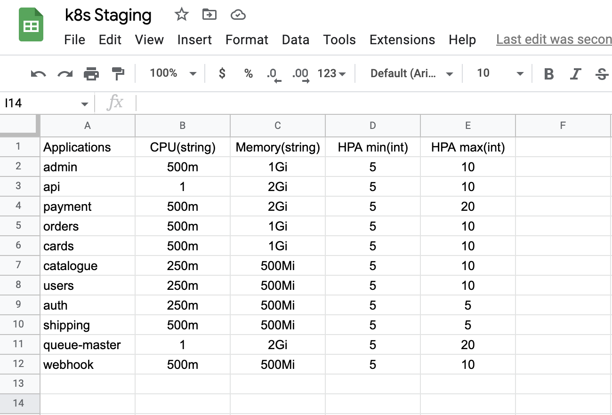

# EventAutomator (SheetOps)


A reliable pre-scaling system through the spreadsheet without straying from GitOps methodology.

## GitOps to SheetOps Workflow


Requirement - 
- credentials.json from google workspace.
- Pre-configured Rundeck server.

Configurations sample -
```
# config.yaml
---
credential: "credentials.json"
logfile: "scale.log"
target: 
  url: "http://rundeck-stag:8080/api/41/webhook/T4AUvRkurNpEhg1YEo4pwcg3CoNvVacn"
  apikey: "abcdefghij0ElqaYanojYZmEQy"
spreadsheet:
  id: "abcdefghi6aYo4atM8GCrWn5D1jt9u0"
  readrange: "A2:E"
calendar:
  id: "abcdefgh@group.calendar.google.com"
  event: "[SheetOps] Scaling K8s"
```

## Sample Sheet


